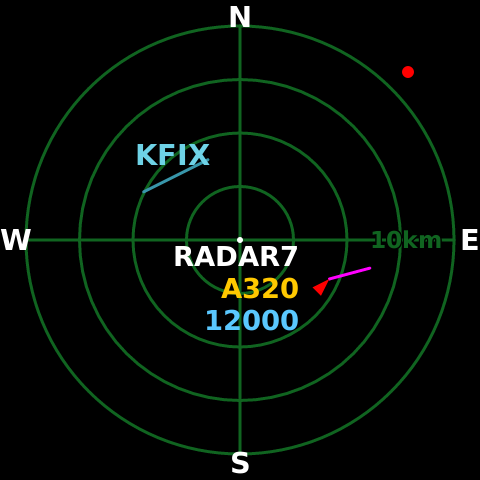

# Plane Radar for Raspberry Pi

[](https://github.com/shayne/RPi-Plane-Radar/actions/workflows/ci.yml)



Plane Radar turns a Raspberry Pi Zero 2 W and a Pimoroni HyperPixel 2.1 Round
touchscreen into a dedicated, hardware-accelerated ADS-B radar. It has a native
480×480 interface, a local settings page, touch gestures, airport runways,
kilometre or mile ranges, and a hardened boot service.

The Raspberry Pi must already have working networking. Plane Radar never
configures, resets, or manages Wi-Fi.

## Supported system

The tested product configuration is:

- Raspberry Pi Zero 2 W;
- Pimoroni HyperPixel 2.1 Round with touch, connected directly to the GPIO
  header;
- 64-bit Raspberry Pi OS based on Debian or Raspbian 12 or 13; and
- the full KMS graphics stack with the repository's HyperPixel panel/touch
  driver.

The installer deliberately rejects other boards, operating-system releases,
non-AArch64 artifacts, mismatched checksums, and mismatched revisions. The
accepted hardware-driver build and recovery procedure are documented in
[the HyperPixel runbook](docs/hardware/hyperpixel2r-driver.md). Kernel upgrades
must repeat that driver acceptance process before the new kernel is trusted.

## What it displays

- Live aircraft from the [adsb.fi open-data API](https://opendata.adsb.fi/).
- Red heading symbols, magenta speed vectors, callsign/type/altitude labels,
  and directional rim dots for traffic beyond the scope.
- Nearby large-airport runways derived from
  [OurAirports](https://ourairports.com/data/).
- Four saved range presets, with labels in kilometres or miles.
- A visible `DATA STALE` warning after 30 seconds without fresh traffic while
  retaining the last good radar picture.

The application polls successfully at most once every three seconds and uses
bounded exponential backoff after failures. It does not put coordinates,
search terms, aircraft data, form bodies, or security tokens in `/healthz` or
normal logs.

## Touch controls

| Gesture | Result |
| --- | --- |
| Short tap on radar | Advance to the next saved range |
| Hold for 3 seconds | Open the settings QR screen |
| Tap the settings QR screen | Return to radar |
| Tap before location setup | No action; setup remains mandatory |

A long-press release is consumed, so it cannot also change the range.

## First-run setup

When no location is saved, the display shows a QR code and both available HTTP
URLs:


Open `http://planeradar.local` or the displayed `http://<ip-address>` from a
device on the same LAN. Search for a place using the OpenStreetMap Nominatim
form, or enter latitude and longitude manually. The page also controls units,
the runway overlay, and range. Saving writes one private settings file and the
running display moves to radar as soon as the first ADS-B request succeeds.

Browser geolocation is not requested. Search results are not saved unless the
user selects one and submits the settings form.

## Development environment

The repository pins Rust and its development tools with
[mise](https://mise.jdx.dev/). On macOS, the ARM64 build uses Docker Buildx;
[OrbStack](https://orbstack.dev/) is a fast compatible runtime.

```sh
git clone https://github.com/shayne/RPi-Plane-Radar.git
cd RPi-Plane-Radar
mise install
mise run verify
mise run test-driver-protocol
```

`mise run verify` runs formatting, clippy with warnings denied, the complete
test suite, and dependency policy checks. Native SDL development libraries are
required when running checks on Linux.

## Build and deploy

Set the SSH target for the prepared Pi. The value is shared by the application
and HyperPixel scripts:

```sh
export PLANERADAR_PI_TARGET=your-user@planeradar.local
mise run build-pi
mise run deploy-pi
```

The build requires a clean tracked workspace. It creates an AArch64 binary and
four provenance files:

```text
dist/planeradar
dist/planeradar.sha256
dist/planeradar.revision
dist/planeradar.tree
dist/planeradar.readelf.txt
```

Deployment verifies the checksum on the Pi and records its temporary staging
directory in `dist/last-stage-path`.

## Install

Run the staged, verified AArch64 binary as its own installer:

```sh
stage="$(cat dist/last-stage-path)"
ssh -t "$PLANERADAR_PI_TARGET" \
  "sudo '$stage/planeradar' install \
    --artifact '$stage/planeradar' \
    --checksum-file '$stage/planeradar.sha256' \
    --revision-file '$stage/planeradar.revision'"
```

The installer:

1. verifies the Pi model, OS, artifact architecture, SHA-256, embedded
   revision, display declaration, and filesystem types before mutation;
2. installs the SDL runtime, CA certificates, and Avahi;
3. creates the locked-down `planeradar` service account;
4. atomically installs the binary, provenance files, and systemd unit;
5. preserves existing settings and the accepted display calibration; and
6. enables and starts `planeradar.service`.

It prints three machine-readable result lines. Reboot only when
`reboot_required=true`; an application-only update does not need one. Passing
`--reboot` allows the installer to reboot automatically when it made a boot
configuration change.

Running the same installer again is supported and should report:

```text
files_changed=false
boot_config_changed=false
reboot_required=false
```

## Update

Pull or select the desired clean revision, then repeat build, deploy, and
install. The installer restarts the service only when installed content or
permissions changed. It never replaces an accepted revisioned HyperPixel
overlay during an application-only update.

## Operate and diagnose

```sh
ssh "$PLANERADAR_PI_TARGET" systemctl status planeradar
ssh "$PLANERADAR_PI_TARGET" sudo journalctl -u planeradar -f
curl --fail -H 'Host: planeradar.local' http://planeradar.local/healthz
```

`/healthz` reports only whether setup is complete, the current UI state,
whether data are stale, and the exact application revision.

To save the current logical 480×480 frame:

```sh
ssh "$PLANERADAR_PI_TARGET" 'sudo systemctl kill --signal=SIGUSR1 planeradar'
ssh "$PLANERADAR_PI_TARGET" \
  'sudo cp /var/lib/planeradar/debug.png "$HOME/planeradar-debug.png" &&
   sudo chown "$USER:$USER" "$HOME/planeradar-debug.png"'
scp "$PLANERADAR_PI_TARGET:planeradar-debug.png" .
```

The capture can contain live callsigns and should be treated as operational
data. See [Troubleshooting](docs/troubleshooting.md) for display, touch,
network, data, settings, and service checks.

## Installed paths

| Path | Purpose |
| --- | --- |
| `/opt/planeradar/bin/planeradar` | Root-owned application and installer |
| `/opt/planeradar/REVISION` | Exact embedded source revision |
| `/opt/planeradar/SHA256` | Installed artifact checksum sidecar |
| `/etc/systemd/system/planeradar.service` | Hardened boot service |
| `/var/lib/planeradar/settings.json` | Private persistent settings |
| `/var/lib/planeradar/geocode-cache.json` | Private bounded search cache |
| `/var/lib/planeradar/debug.png` | Latest requested logical frame |
| `/boot/firmware/config.txt.planeradar-backup` | First installer boot backup |

## Uninstall

The following removes the application and service while preserving settings
and the display driver:

```sh
sudo systemctl disable --now planeradar.service
sudo rm /etc/systemd/system/planeradar.service
sudo rm -r /opt/planeradar
sudo systemctl daemon-reload
sudo userdel planeradar
```

Remove `/var/lib/planeradar` separately only when its saved location,
preferences, cache, and debug capture are no longer wanted. Display-driver
rollback is a separate boot-critical operation; follow
[the HyperPixel runbook](docs/hardware/hyperpixel2r-driver.md) instead of
manually editing boot files.

## Architecture and provenance

[Architecture](docs/architecture.md) describes process ownership, immutable
runtime snapshots, rendering, network policy, settings persistence, artifact
verification, and hardware checkpoints.

This repository is an independent Rust derivative of
[MatixYo/ESP32-Plane-Radar](https://github.com/MatixYo/ESP32-Plane-Radar).
It preserves the upstream history and credits the original radar concept, but
it is intentionally not a GitHub fork: the Raspberry Pi hardware, operating
model, graphics stack, touch input, web service, installer, and implementation
are substantially different.

Plane Radar is distributed under the [MIT License](LICENSE).

The renderer embeds DejaVu Sans Bold 2.37. DejaVu incorporates Bitstream Vera
and Arev-derived glyphs by Tavmjong Bah; the complete notices and terms are
preserved in
[`src/assets/DejaVu-FONT-LICENSE.txt`](src/assets/DejaVu-FONT-LICENSE.txt).
