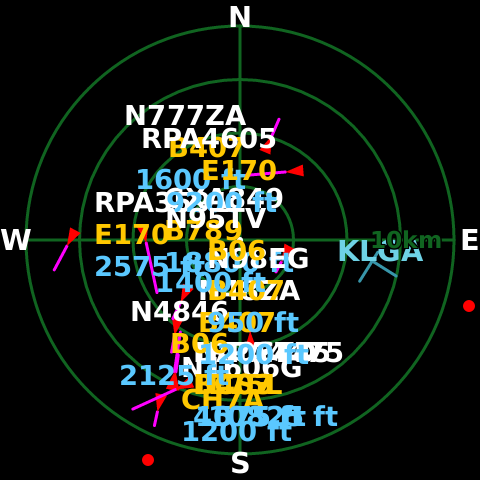

# Plane Radar for Raspberry Pi

[](https://github.com/shayne/RPi-Plane-Radar/actions/workflows/ci.yml)

Plane Radar turns one very specific pile of hardware into a small, dedicated
ADS-B radar: a Raspberry Pi Zero 2 W, a Pimoroni HyperPixel 2.1 Round, and
64-bit Raspberry Pi OS Lite Trixie.

That narrow support statement is deliberate. This configuration has been
tested on the physical display. Broader Pi, display, and OS support is not
claimed. A stable release remains gated on the final history, exact-release,
and clean-room acceptance work; until then, treat this as release-candidate
software.

Most of the implementation was built with substantial OpenAI Codex
assistance. The commit history credits that work explicitly; maintainers still
own the review and the hardware result.



## Install from a Mac

The Pi must already boot, join Wi-Fi, and accept your SSH public key. Wi-Fi and SSH must already work. Plane Radar does not configure Wi-Fi.

On the Mac you need Git, [mise](https://mise.jdx.dev/), OpenSSH, the GitHub CLI (`gh`)
with an active authenticated session, and Docker Desktop,
[OrbStack](https://orbstack.dev/), or another Docker Buildx-compatible
runtime. Check GitHub authentication with `gh auth status`. The supported
install host is macOS.

```sh
git clone https://github.com/shayne/RPi-Plane-Radar.git
cd RPi-Plane-Radar
mise install
mise run install -- user@host
```

With no release selector, the controller resolves the latest stable release
from GitHub and rejects drafts, prereleases, and malformed tags.
`pi@raspberrypi.local` is a useful example, not an assumption about your Pi.
With no command-line or `.env` target, an interactive terminal asks for one.
`--non-interactive` fails instead of prompting. The installer asks for sudo on
the Pi when it needs it. It verifies the Mac, the target, the application
release, and the separately versioned display driver before changing either
boot or service state.

There is no stable release yet. While that remains true, select an immutable
release candidate explicitly:

```sh
mise run install -- user@host --version 0.1.0-rc.N
```

The installer defaults the final hostname to `planeradar`. It may reboot once
to test the display driver through Raspberry Pi tryboot and again after the
hostname change. The transaction is saved after each verified phase, so rerun
the same command if the Mac exits or a reboot outlasts the connection window.
The boring state file is what makes that safe; guessing which step finished
would not.

Read [Installation](docs/install.md) before using a release candidate or a
local release directory.

## Configure the radar

The first boot shows a QR code plus `http://planeradar.local` and the Pi's
numeric `http://` URL. Open either URL from the same LAN, search for an address
or enter coordinates, then choose units, runway visibility, and range.

The location is stored only on the Pi. Plane Radar does not request browser
geolocation, and it does not configure the network. A short tap advances the
saved range. A three-second hold opens the QR screen; tapping that screen
returns to the radar.

## Operate it from the Mac

These commands use the same `user@host` target and the SSH host identity saved
during installation:

```sh
mise run status -- user@host
mise run doctor -- user@host
mise run doctor -- user@host --json
mise run screenshot -- user@host --output planeradar-radar.png
```

`status` is the short answer. `doctor` compares the installed application,
driver, kernel, display mode, renderer, touch device, service, HTTP endpoint,
and mDNS result with the accepted release identities. `screenshot` asks the
running renderer for a new 480×480 RGBA frame and refuses stale or unsafe
files.

The frame may contain live callsigns. Treat it as operational data, not a
harmless decoration for an issue.

## Upgrade, roll back, or remove it

Choose immutable versions for changes:

```sh
mise run upgrade -- user@host --version 0.1.0-rc.N
mise run rollback -- user@host
mise run uninstall -- user@host
mise run uninstall -- user@host --purge-settings
```

Application-only upgrades switch binaries atomically and do not reboot. A
driver change uses the same one-shot tryboot, verification, and commit flow as
the first install. Plane Radar keeps the current and previous two accepted
application/driver pairs so a failed change has somewhere real to go back to.

Plain `uninstall` removes installer-owned application and driver state but
preserves settings. `--purge-settings` also removes the saved location and
preferences. Both forms perform a mandatory normal reboot while removing the
accepted display driver, then require an identity-bound reconnect before
final cleanup. Expect SSH to disappear. If reconnect or cleanup is
interrupted, retry the exact same uninstall command, including the original
purge choice. Uninstall still does not own Wi-Fi, SSH, or unrelated boot
lines.

See [Upgrading](docs/upgrading.md) for version selection and
[Recovery](docs/recovery.md) for interrupted installs, host-key changes,
tryboot fallback, blank displays, and rollback.

## Verified release bootstrap

Release assets include `install.sh` for a fresh Mac that does not need a Rust
build. Download it with GitHub CLI, then run it with a target:

```sh
gh release download v0.1.0-rc.N -R shayne/RPi-Plane-Radar --pattern install.sh --output planeradar-install.sh
bash planeradar-install.sh --version 0.1.0-rc.N user@host
```

The bootstrap is macOS-only and requires `gh`. It resolves the immutable tag,
checks GitHub release integrity, verifies checksums and attestations, selects
the matching Apple Silicon or Intel control binary, and launches that verified
binary. A curl-to-shell shortcut would skip the useful part, so this project
does not recommend one.

## What lives where

The Mac keeps private controller state under
`${XDG_STATE_HOME}/planeradar/installer` or
`~/.local/state/planeradar/installer`, keyed by the SSH host-key fingerprint.
Verified downloads and extracted payloads live under `~/.cache/planeradar`.
Neither directory belongs in the repository.

The Pi keeps installer transactions under `/var/lib/planeradar-installer`,
application settings and cache under `/var/lib/planeradar`, accepted binaries
under `/opt/planeradar`, and driver state under
`/var/lib/hyperpixel2r-kms` and `/usr/lib/hyperpixel2r-kms`. Temporary uploads
live under `/var/tmp` and are not authority.

[Architecture](docs/architecture.md) follows those boundaries end to end.
The exact paths, ownership rules, and recovery consequences are in
[Installation](docs/install.md) and [Recovery](docs/recovery.md).

## Development and project status

```sh
mise install
mise run verify
mise run docs-check
```

The repository pins Rust and its development tools with mise. CI repeats the
Rust, release, fixture, documentation, and native macOS control checks. Release
workflows build deterministic ARM64 application and macOS control archives,
generate an SPDX SBOM, and attest the release subjects.

The HyperPixel kernel code is not vendored or attached as a submodule. Plane
Radar pins an immutable release from the separate
[hyperpixel2r-kms project](https://github.com/shayne/hyperpixel2r-kms) by
repository, version, full commit, and manifest digest. That separation matters:
an application update is ordinary; a display driver update can decide whether
the Pi comes back after reboot.

Read [Development](docs/development.md), [Troubleshooting](docs/troubleshooting.md),
[Contributing](CONTRIBUTING.md), and [Security](SECURITY.md) before changing
those boundaries.

## Credit, licenses, and AI disclosure

Plane Radar takes its product idea from
[MatixYo/ESP32-Plane-Radar](https://github.com/MatixYo/ESP32-Plane-Radar).
This repository is an independent Raspberry Pi implementation, not a GitHub fork.
Its Rust application, KMS/SDL runtime, Mac control plane, installer, and web
setup flow are separate work.

The project was built with substantial OpenAI Codex assistance. Codex is
credited in commit trailers. Human maintainers remain responsible for review,
testing, releases, and what runs on real hardware.

Plane Radar is distributed under the [MIT License](LICENSE). The external
HyperPixel driver is GPL-2.0-only and carries its own upstream provenance.
The bundled DejaVu Sans Bold font retains its
[DejaVu, Bitstream Vera, and Arev notices](src/assets/DejaVu-FONT-LICENSE.txt).
