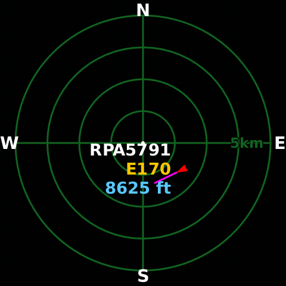

# Plane Radar for Raspberry Pi

[](https://github.com/shayne/RPi-Plane-Radar/actions/workflows/ci.yml)

Plane Radar is a Rust ADS-B display for the Raspberry Pi Zero 2 W and
Pimoroni HyperPixel 2.1 Round. It is tested with 64-bit Raspberry Pi OS Lite Trixie
on the physical display.

The supported configuration is intentionally narrow. Other Raspberry Pi
models, displays, and operating-system releases are not currently supported.
[Version 0.1.1](https://github.com/shayne/RPi-Plane-Radar/releases/tag/v0.1.1)
is the current immutable stable release.



## Install from a Mac

The Pi must already boot, join Wi-Fi, and accept your SSH public key. Wi-Fi and SSH must already work. Plane Radar does not configure Wi-Fi.

On the Mac you need Git, [mise](https://mise.jdx.dev/), OpenSSH, the GitHub CLI (`gh`)
with an active authenticated session, and Docker Desktop,
[OrbStack](https://orbstack.dev/), or another Docker Buildx-compatible
runtime. Check GitHub authentication with `gh auth status`. The supported
install host is macOS.

```sh
git clone https://github.com/shayne/RPi-Plane-Radar.git
cd RPi-Plane-Radar
mise install
mise run install -- user@host
```

With no release selector, the controller resolves the latest stable release
from GitHub and rejects drafts, prereleases, and malformed tags.
`pi@raspberrypi.local` is a useful example, not an assumption about your Pi.
With no command-line or `.env` target, an interactive terminal asks for one.
`--non-interactive` fails instead of prompting. The installer asks for sudo on
the Pi when it needs it. It verifies the Mac, the target, the application
release, and the separately versioned display driver before changing either
boot or service state.

The default command installs the latest immutable stable release. To reproduce
the first accepted release exactly, pin it explicitly:

```sh
mise run install -- user@host --version 0.1.0
```

The installer defaults the final hostname to `planeradar`. It may reboot once
to test the display driver through Raspberry Pi tryboot and again after the
hostname change. The transaction records every verified phase. If the Mac exits
or a reboot outlasts the connection window, rerun the same command to resume
safely.

Read [Installation](docs/install.md) before pinning another version or using a
local release directory.

## Configure the radar

The first boot shows a QR code plus `http://planeradar.local` and the Pi's
numeric `http://` URL. Open either URL from the same LAN, search for an address
or enter coordinates, then choose units, runway visibility, and range. That is
the complete default path; upgrades keep the same display and make no new
provider requests until you enable an optional feature.

Radar text size scales radar typography from 80% through 130%. The remaining
optional controls are organized in three expandable groups:

- **Aircraft labels:** **Show callsign** stays on by default. **Show origin and
  destination** and **Show expanded aircraft model** are off by default.
- **Footer:** independently show **Weather condition**, temperature, humidity,
  time, and date. Choose Celsius or Fahrenheit, Radar location or Zulu time,
  and a 12-hour or 24-hour clock.
- **Traffic filter:** set an optional Minimum altitude and Maximum altitude in
  feet. Altitude is always interpreted in feet, even when distance uses
  nautical miles or kilometers. Blank bounds are open. Unknown-altitude
  aircraft remain visible with no bound; while either bound is active,
  unknown-altitude aircraft are hidden.

Provider-backed enrichment and environment data are off by default; all new
provider features are optional. For the exact privacy boundary, routes send the
aircraft callsign to ADSBDB and models send the aircraft identifier; enabling
both means those values may share one request. Weather and radar-local time
send the configured coordinates to Open-Meteo. Zulu-only time and date send
nothing to Open-Meteo.

The saved location is persisted locally on the Pi. When an enabled feature
requires Open-Meteo, Plane Radar also transmits the configured coordinates as
described above. Plane Radar does not control Open-Meteo's retention or
handling of transmitted data. Plane Radar does not request browser geolocation,
and it does not configure the network. A short tap advances the saved range. A
three-second hold opens the QR screen; tapping that screen returns to the radar.

## Operate it from the Mac

These commands use the same `user@host` target and the SSH host identity saved
during installation:

```sh
mise run status -- user@host
mise run doctor -- user@host
mise run doctor -- user@host --json
mise run screenshot -- user@host --output planeradar-radar.png
```

`status` is the short answer. `doctor` compares the installed application,
driver, kernel, display mode, renderer, touch device, service, HTTP endpoint,
and mDNS result with the accepted release identities. `screenshot` asks the
running renderer for a new 480×480 RGBA frame and refuses stale or unsafe
files.

The frame may contain live callsigns and should be treated as operational
data.

## Upgrade, roll back, or remove it

Upgrade to the latest immutable stable release, roll back to a retained
release, or remove Plane Radar:

```sh
mise run upgrade -- user@host
mise run rollback -- user@host
mise run uninstall -- user@host
mise run uninstall -- user@host --purge-settings
```

Pass `--version X.Y.Z` to `upgrade` when you need a specific stable release.

Application-only upgrades switch binaries atomically and do not reboot. A
driver change uses the same one-shot tryboot, verification, and commit flow as
the first install. Plane Radar retains the current and previous two accepted
application and driver pairs for rollback.

Plain `uninstall` removes installer-owned application and driver state but
preserves settings. `--purge-settings` also removes the saved location and
preferences. Both forms perform a mandatory normal reboot while removing the
accepted display driver, then require an identity-bound reconnect before
final cleanup. Expect SSH to disappear. If reconnect or cleanup is
interrupted, retry the exact same uninstall command, including the original
purge choice. Uninstall still does not own Wi-Fi, SSH, or unrelated boot
lines.

See [Upgrading](docs/upgrading.md) for version selection and
[Recovery](docs/recovery.md) for interrupted installs, host-key changes,
tryboot fallback, blank displays, and rollback.

## Verified release bootstrap

Release assets include `install.sh` for a fresh Mac that does not need a Rust
build. Download it with GitHub CLI, then run it with a target:

```sh
gh release download -R shayne/RPi-Plane-Radar --pattern install.sh --output planeradar-install.sh
bash planeradar-install.sh user@host
```

The bootstrap is macOS-only and requires `gh`. It resolves the immutable tag,
checks GitHub release integrity, verifies checksums and attestations, selects
the matching Apple Silicon or Intel control binary, and launches that verified
binary. The project does not provide a curl-to-shell path because that would
bypass these verification steps.

## What lives where

The Mac keeps private controller state under
`${XDG_STATE_HOME}/planeradar/installer` or
`~/.local/state/planeradar/installer`, keyed by the SSH host-key fingerprint.
Verified downloads and extracted payloads live under `~/.cache/planeradar`.
Neither directory belongs in the repository.

The Pi keeps installer transactions under `/var/lib/planeradar-installer`,
application settings and cache under `/var/lib/planeradar`, accepted binaries
under `/opt/planeradar`, and driver state under
`/var/lib/hyperpixel2r-kms` and `/usr/lib/hyperpixel2r-kms`. Temporary uploads
live under `/var/tmp` and are not authority.

[Architecture](docs/architecture.md) follows those boundaries end to end.
The exact paths, ownership rules, and recovery consequences are in
[Installation](docs/install.md) and [Recovery](docs/recovery.md).

## Development and project status

```sh
mise install
mise run verify
mise run docs-check
```

The repository pins Rust and its development tools with mise. CI repeats the
Rust, release, fixture, documentation, and native macOS control checks. Release
workflows build deterministic ARM64 application and macOS control archives,
generate an SPDX SBOM, and attest the release subjects.

The HyperPixel kernel code is not vendored or attached as a submodule. Plane
Radar pins an immutable release from the separate
[hyperpixel2r-kms project](https://github.com/shayne/hyperpixel2r-kms) by
repository, version, full commit, and manifest digest. Application and driver
releases are versioned separately because driver changes affect the boot path.

Read [Development](docs/development.md), [Troubleshooting](docs/troubleshooting.md),
[Contributing](CONTRIBUTING.md), and [Security](SECURITY.md) before changing
those boundaries.

## Credit, licenses, and AI disclosure

Plane Radar takes its product idea from
[MatixYo/ESP32-Plane-Radar](https://github.com/MatixYo/ESP32-Plane-Radar).
This repository is an independent Raspberry Pi implementation, not a GitHub fork.
Its Rust application, KMS/SDL runtime, Mac control plane, installer, and web
setup flow are separate work.

The project was built with substantial OpenAI Codex assistance. Codex is
credited in commit trailers. Human maintainers remain responsible for review,
testing, releases, and what runs on real hardware.

Plane Radar is distributed under the [MIT License](LICENSE). The external
HyperPixel driver is GPL-2.0-only and carries its own upstream provenance.
The bundled DejaVu Sans Bold font retains its
[DejaVu, Bitstream Vera, and Arev notices](src/assets/DejaVu-FONT-LICENSE.txt).
