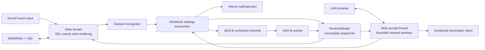

# Architecture

Plane Radar is a single Rust process with explicit ownership boundaries around
display I/O, mutable settings, network workers, and published state. The
application is designed for a Raspberry Pi Zero 2 W, where predictable memory
use, bounded work, and recoverable boot behavior matter more than framework
flexibility.

## Runtime shape



The main thread owns SDL, the KMS presentation loop, both renderers, current
frame retention, gesture recognition, and the visible application state. SDL
objects never cross a thread boundary.

`RuntimeCoordinator` creates two long-lived workers:

- the web accept thread serves the local settings and health endpoints; and
- the ADS-B worker fetches traffic for the current location and range.

The web server may create up to 16 bounded per-request workers so a slow client
cannot block health or another settings request. The Nominatim client is behind
one mutex because its cache and request-rate clock have single-owner semantics.

SIGINT and SIGTERM set a shared stop flag. The display loop coordinates worker
shutdown and joins both long-lived workers before process exit.

## Immutable publication

`RuntimeModel` stores one `RuntimeSnapshot` behind an `Arc<RwLock<_>>`.
Readers clone a complete snapshot containing settings, an `Arc<[Aircraft]>`,
fetch timestamps, URLs, and a monotonically increasing generation. A renderer
therefore sees one consistent point in time instead of fields updated
independently.

ADS-B results and errors are conditionally published under the model write
lock. The worker includes the location and range it queried; if settings
changed while the request was in flight, that old result is discarded. A
location change also clears the successful-fetch marker, while transient
network errors retain the last good aircraft snapshot.

All settings updates—browser saves and touch-driven range changes—share one
transaction mutex. The transaction:

1. derives a candidate from the latest model;
2. validates and atomically persists it;
3. publishes it to the model; and
4. wakes the ADS-B worker.

No observer can interleave a second settings write inside that sequence.

## Application states

The visible state is derived from runtime facts plus the local settings-screen
flag:

| State | Condition |
| --- | --- |
| `SETUP_REQUIRED` | No saved location |
| `WAITING_FOR_NETWORK` | Location exists, but the current location has no successful fetch |
| `RADAR` | Current location has at least one successful response |
| `SETTINGS` | A configured user opened the QR page with a long press |

Once radar has valid data, transient failures do not replace it with a setup
screen. At 30 seconds the renderer adds `DATA STALE`; fresh data removes the
notice.

## Display and rendering

SDL is configured for the `kmsdrm` video backend and `opengles2` renderer. It
uploads a native 480×480 logical RGBA frame to the KMS scanout path. The
application redraws only when the model generation, visible state, or stale
boundary changes, but retained frames remain presentable on every display
tick.

The Rust renderer uses integer pixel metrics and `tiny-skia`. Static radar
geometry and runway labels are cached by the exact coordinate bits, range,
units, and runway toggle. Each dynamic frame starts from that cache and draws
aircraft, vectors, tags, and stale status. Aircraft and airport input are
bounded before drawing. Text is painted last with transparent glyph
backgrounds; only the range label receives a one-pixel shape outline.

The setup renderer creates a medium-error-correction QR code for the URL
derived from the installed hostname (or an explicit local-URL override). It
uses the largest integer module scale that fits the circular safe region and
preserves an exact four-module quiet zone.

SIGUSR1 atomically saves the current logical frame to
`/var/lib/planeradar/debug.png`; it does not scrape the physical framebuffer.

## Touch boundary

The custom kernel platform driver owns the HyperPixel panel GPIO lifecycle and
creates the FT5x06 child input device. User space never toggles panel GPIO or
opens a raw I2C bus.

SDL normalizes press, motion, and release into logical 480×480 coordinates.
The gesture recognizer accepts a tap only after a valid press/release, cancels
after movement beyond 18 pixels, debounces releases, and emits one long press
after a continuous three seconds. The release after a long press is consumed.

## Settings schema and persistence

`/var/lib/planeradar/settings.json` uses schema version 1:

```json
{
  "schema_version": 1,
  "location": {
    "latitude": 40.7128,
    "longitude": -74.006,
    "label": "Selected place"
  },
  "units": "km",
  "show_runways": true,
  "range_index": 1
}
```

`location` may be `null` before setup. Unknown fields, unsupported schema
versions, non-finite or out-of-range coordinates, and range indices outside
0–3 are rejected. Writes use a same-directory temporary file, `fsync`, atomic
rename, and parent-directory `fsync`. The service owns the state directory at
0750 and settings at 0600.

## Network and privacy policy

All external requests require HTTPS with WebPKI certificate validation and
bounded DNS, connect, response, body, and global timeouts.

The ADS-B worker:

- requests the adsb.fi v3 endpoint with a radius derived from the visible
  range;
- accepts at most 64 aircraft;
- starts successful requests at least three seconds apart; and
- backs failures off through 3, 6, 12, 24, then 30 seconds.

The Nominatim client:

- sends the required identifying user agent;
- starts cache misses at least 1.05 seconds apart;
- returns no more than five results;
- keeps successful results for seven days; and
- atomically persists a bounded, schema-validated cache.

The LAN server accepts only the current `.local` and discovered-IP authorities.
Settings changes require a random HttpOnly, SameSite session cookie, matching
CSRF token, valid Origin or Referer, exact form content type, and a body no
larger than 16 KiB. `/healthz` intentionally returns only `configured`,
`state`, `data_stale`, and `revision`.

## Build and artifact provenance

mise pins Rust, cargo-nextest, cargo-deny, and CMake. The application build
requires a clean tracked source tree and archives the exact synthesized
GitButler workspace `HEAD` into an isolated container context. Docker Buildx
produces the ARM64 ELF, while the build script records:

- the exact source revision;
- the exact source tree;
- a SHA-256 sidecar; and
- dynamic-link metadata.

The installer embeds the systemd unit and the same revision. Before any
mutation it verifies the target model and OS, ELF architecture, artifact
checksum, embedded revision, boot declaration, and input file types. Installed
files are atomic and root-owned. Application state is preserved across
updates.

The HyperPixel module has a separate, stricter manifest binding kernel release,
architecture, source revision/tree, base DTB, module vermagic/checksum, and
revisioned overlay. See
[HyperPixel driver operations](hardware/hyperpixel2r-driver.md).

## Service boundary

`planeradar.service` runs without a login as the `planeradar` system account.
It receives only the `video`, `render`, and `input` supplementary groups and
`CAP_NET_BIND_SERVICE`. The unit uses a read-only system view, private home and
temporary directories, no new privileges, a closed device policy restricted
to DRM and input character groups, an address-family allowlist, and one
writable state directory. Failed processes restart after three seconds.

## Hardware acceptance gates

Development used five explicit Pi checkpoints:

1. **Display probe:** one connected native 480×480 KMS display with correct
   physical orientation and a recoverable boot configuration.
2. **Deterministic visuals:** approved radar and setup goldens reproduced on
   the physical round panel; the setup QR scanned to the canonical local URL.
3. **Headless runtime:** real LAN configuration, persistence, live ADS-B,
   health privacy, and clean shutdown worked on the Pi.
4. **Integrated application:** every UI state, tap/hold/release behavior,
   stale-data retention, network recovery, and a real debug frame passed.
5. **Permanent service:** verified installer idempotence, permissions,
   unattended cold boot, hardware acceleration, and automatic crash recovery.

Publication is gated on repeating final acceptance against the exact installed
revision and checksum.
