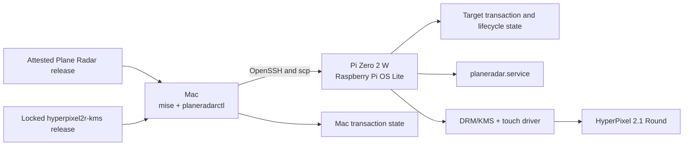
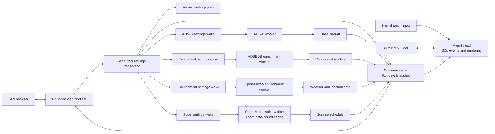

# Architecture

Plane Radar has three moving parts: a Mac control tool, a Raspberry Pi
application, and a separately released HyperPixel kernel driver. Keeping them
separate looks fussy until one of them fails. Then the boundary tells you
whether you are repairing a download, a service, or a boot.

## The installation path



`planeradarctl` resolves one application release and the exact driver identity
in `driver.lock.toml`. Every source install checks checksums, manifests,
repositories, commits, architectures, and release identity before copying
anything to the Pi. Stable source installs additionally verify the GitHub
release and runnable artifact attestations. Explicit source release candidates
stop at the strict manifest, checksum, and identity boundary; the separate
release bootstrap verifies release-candidate attestations before it executes
the controller. OpenSSH receives argument vectors rather than an interpolated
local shell command.

The installer then advances through durable, verified phases:

1. discover and bind the Pi's SSH host key, model, and serial;
2. pass Mac and target preflight;
3. acquire the application and driver;
4. stage, boot, and verify the driver through one-shot tryboot;
5. commit the accepted driver;
6. install the application and service;
7. change the hostname when requested;
8. reboot and verify the complete system; and
9. mark the transaction complete.

A phase is written only after its postcondition succeeds. If the Mac process
dies, the next run reads both sides and resumes only when target identity and
artifact identity still agree. This is why removing a state file to "unstick"
an install is usually the wrong move: the file is not debris. It is the proof
of what already happened.

## State and ownership

| State | Location | Durability | Owner |
| --- | --- | --- | --- |
| Mac install transaction | `${XDG_STATE_HOME}/planeradar/installer/<host-key-sha256>/state.json`, otherwise `~/.local/state/planeradar/installer/<host-key-sha256>/state.json` | Until the transaction is superseded; retired after a successful identity-bound uninstall | Local user, mode 0600 |
| Verified release and payload cache | `~/.cache/planeradar/` | Reusable, content-addressed | Local user, private directory |
| Driver source cache for maintainers | `.cache/driver/` | Rebuildable and ignored | Local checkout |
| Target install transaction | `/var/lib/planeradar-installer/state.json` | Through initial install | root, mode 0600 |
| Target lifecycle history | `/var/lib/planeradar-installer/lifecycle.json` | Through upgrades, rollback, and uninstall | root, mode 0600 |
| Management helpers and captures | `/var/lib/planeradar-installer/helpers/` and `/var/lib/planeradar-installer/captures/` | Transactional or diagnostic | root, private directories |
| Accepted application payloads | `/opt/planeradar/releases/<version>/<sha256>/planeradar` | Current plus previous accepted pairs | root |
| Active application | `/opt/planeradar/bin/planeradar` plus `REVISION` and `SHA256` | Until upgrade or uninstall | root |
| Settings and local caches | `/var/lib/planeradar/settings.json`, `geocode-cache.json`, and `solar-schedule.json` | Settings preserved by default; caches replaceable | `planeradar` service |
| Debug frame | `/var/lib/planeradar/debug.png` | Replaced on request | `planeradar` service |
| Driver acceptance state | `/var/lib/hyperpixel2r-kms/` and `/usr/lib/hyperpixel2r-kms/` | Kernel and driver-version specific | root |
| Temporary uploads | `/var/tmp/planeradar-upload.*` | Disposable | SSH user creates staging; sudo consumes it |

The lifecycle record contains an explicit owned-file manifest. Rollback and
uninstall use that manifest; they do not guess with broad path globs.
Settings are preserved unless the install originally created them and the
user explicitly requests `--purge-settings`.

## The Pi runtime



The main thread owns SDL, rendering, gesture recognition, and visible
application state. SDL objects never cross a thread boundary. A web accept
thread serves settings and health. The runtime uses four independent workers:
the ADS-B worker, ADSBDB enrichment worker, Open-Meteo environment worker, and
Open-Meteo solar worker. Their four settings wake channels let each worker
react immediately without sharing network deadlines. This failure isolation
means a blocked or failed optional provider cannot delay the three-second
primary ADS-B publication cadence. Web requests are bounded to 16 workers.
Nominatim access is serialized because its rate clock and cache have one owner.

`RuntimeModel` publishes a complete immutable snapshot behind an
`Arc<RwLock<_>>`. Each snapshot contains settings, base aircraft, immutable
enrichment, environment, and solar fields, backlight availability, timestamps,
URLs, service status, and a generation number. A renderer sees one point in
time instead of half of one update and half of the next. Late enrichment is
joined only to a still-current aircraft identity, while environment and solar
results are accepted only for the current location and enabled settings.

Settings schema versions 1 and 2 migrate in memory to strict schema version 3.
Existing location, units, runway visibility, and range are preserved; optional
display and provider features receive compatibility defaults. Day brightness
defaults to 100%. Night mode defaults off, while its saved defaults are 30% at
20:00 with red-only off. Loading does not write the migrated value at startup.
The next successful settings change uses the normal atomic version-3 write.

All browser and touch settings changes use one transaction:

1. derive a candidate from the current snapshot;
2. validate and atomically write it;
3. publish the new snapshot; and
4. notify all four settings wake channels.

Old aircraft replies are discarded when their location or range no longer
matches. The enrichment cache keeps structured ADSBDB route candidates and
model strings for six hours and definite misses for ten minutes, with bounded
least-recently-used eviction. Cached route candidates are re-evaluated against
every live aircraft position using a conservative great-circle corridor;
implausible candidates publish no route, while valid midpoints remain visible
in the compact label. The environment worker refreshes required weather or
radar-local time data no more than once every 15 minutes after success.
Zulu-only time and date need no Open-Meteo request.

Enabled night mode uses the configured location's coordinates only while it
needs sunrise data. The solar worker loads its coordinate-bound cache first,
then refreshes independently; failures leave every other worker and the last
usable schedule intact. Provider failures publish only sanitized categories
and retry on a bounded, rate-limited backoff. Open-Meteo response and error
bodies never enter the display, browser status, or normal logs. The runtime
data flow is:

```text
settings + location -> isolated solar worker/cache -> immutable snapshot
snapshot + wall time -> pure radar-local policy
policy + monotonic time -> backlight controller/ramp
normal renderer -> one final frame transform -> debug/upload/physical display
```

The pure schedule policy uses the configured radar location's IANA time zone,
never the browser or Pi host civil time. A night interval is `[start, end)`,
where `end` is the first valid sunrise strictly after its configured start. If
the cached forecast has no such sunrise, the policy uses 07:00 the next day in
that same radar-local zone. The display loop re-evaluates policy on every step;
snapshot generation, wall-clock minute, and effective color-mode changes are
render invalidations. The web handler renders one immutable snapshot and does
not perform provider or sysfs I/O on the request path.

Primary position age alone controls `DATA STALE`; service errors do not set
`DATA STALE`. When the primary feed stops, the last good frame remains visible
and gains that label after 30 seconds. Enrichment silently falls back to the
primary feed's callsign and short aircraft type. Before an environment result,
selected weather renders `WX --`; after last-known environment data passes its
45-minute stale boundary, it remains visible with `WX STALE`. Time and date add
minute-based clock redraws so they continue advancing during a primary feed
outage without redrawing each second.

## Display and touch

The external
[hyperpixel2r-kms](https://github.com/shayne/hyperpixel2r-kms) platform driver
owns the panel GPIO and PWM-backed backlight lifecycle, exposes the named
standard backlight device, and creates the FT5x06 input child. The application
uses only `/sys/class/backlight/planeradar-backlight`; it does not toggle panel
GPIO, program PWM, or open raw I2C.

SDL uses `kmsdrm` with the `opengles2` renderer and uploads a native 480×480
RGBA frame. Static radar geometry is cached. Aircraft and text are drawn from
bounded inputs, with transparent glyph backgrounds and a one-pixel outline on
the range label. Integer pixel metrics keep the round display sharp. The
`tests/goldens/settings.png` fixture is the physical QR settings screen and
must remain unchanged. The browser settings UX is verified through HTML
contracts and viewport inspection rather than that device golden.

Brightness transitions are nonblocking ramps driven by monotonic time over two
seconds. Entering red night mode dims the full-color frame before applying red;
leaving it restores full color before brightening. Startup in an already-active
red interval renders red immediately. Backlight absence and write failures are
nonfatal; the application exposes sanitized availability and rate-limits
hardware failure reporting to once per 30 seconds.

Red-only mode is one integer-luma final transform after normal rendering and
before the current frame is saved or uploaded. It therefore covers every
physical setup, waiting, settings, and radar frame without duplicating color
logic inside individual renderers. The browser settings page remains full
color because it is outside the physical frame pipeline.

A tap advances range. Motion beyond 18 pixels cancels the tap. A continuous
three-second hold opens settings, and its release is consumed so the range
does not also change.

SIGUSR1 makes the unprivileged `planeradar` service write its current logical
frame to the service-owned `/var/lib/planeradar/debug.png`. The privileged
capture helper validates the source owner, group, mode, identity, and
freshness, then publishes a root-private snapshot at
`/var/lib/planeradar-installer/captures/current.png`. The controller copies
that snapshot and decodes it locally as exact 480×480 8-bit RGBA. It does not
scrape the framebuffer.

## Local web boundary

The settings server listens on port 80 and accepts only the installed
`http://<hostname>.local` authority and discovered numeric-IP authorities. The
default hostname is `planeradar`; it is not compiled as universal truth.

Settings changes require an HttpOnly SameSite session cookie, a matching CSRF
token, a valid Origin or Referer, the exact form content type, and a body no
larger than 16 KiB. `/healthz` exposes only setup state, UI state, stale state,
and application revision.

External ADS-B and geocoding requests use HTTPS with bounded DNS, connection,
response, body, and overall timeouts. Normal logs omit coordinates, searches,
aircraft payloads, form bodies, cookies, and CSRF values.

## Releases and the driver boundary

The application release contains an ARM64 Pi archive, native Apple Silicon and
Intel control archives, `install.sh`, a strict manifest, checksums, and an SPDX
SBOM. CI builds from an exact commit with normalized archive ownership and
timestamps. GitHub release and artifact attestations bind the runnable files
to that source. The source controller enforces those GitHub checks for stable
releases; release-candidate source installs retain the manifest, checksum, and
identity checks but skip the stable-only attestation policy. The release
bootstrap verifies attestations for release candidates too.

The kernel driver lives in its own GPL-2.0-only repository. Plane Radar does
not vendor it or use a submodule. `driver.lock.toml` pins the repository,
semantic version, full commit, release-manifest digest, and lifecycle protocol.
It also requires the `pwm-backlight-v1` capability and verifies the driver's
backlight rule as part of its identity. The currently published locked driver
manifest predates that capability and is intentionally insufficient; a
compatible driver must be explicitly published and pinned before a public
Plane Radar release can use brightness.

Local physical staging may install a reversible source candidate to test the
driver and application together. It does not create or select a stable driver,
and it produces no push, tag, GitHub release, or public package.

An exact-kernel prebuilt archive is preferred; Docker cross-builds against the
target kernel context when no matching archive exists. A failed refresh may
fall back to a byte-valid earlier build for that exact kernel; the target-side
stage protocol revalidates its manifest and postconditions before use.

Driver activation is a boot transaction. The candidate lives in
`tryboot.txt`. Plane Radar asks the driver to stage without rebooting, persists
`TrybootStaged` on both sides of the SSH boundary, and only then performs the
single `reboot "0 tryboot"` itself. Automated probes check the module, overlay,
DRM mode, touch, SDL driver, and renderer before the normal boot configuration
is committed. If the trial does not return, the next power cycle falls back to
the prior normal boot.

## Service boundary

`planeradar.service` runs as the `planeradar` system account with only the
`video`, `render`, and `input` groups and `CAP_NET_BIND_SERVICE`. The unit uses
a read-only system view, private home and temporary directories, no new
privileges, a closed device policy limited to DRM and input character devices,
an address-family allowlist, and one writable state directory.

The architecture is intentionally boring at the boundaries: verified bytes
move forward, durable state says how far they got, and each owner removes only
what it can prove belongs to it.
